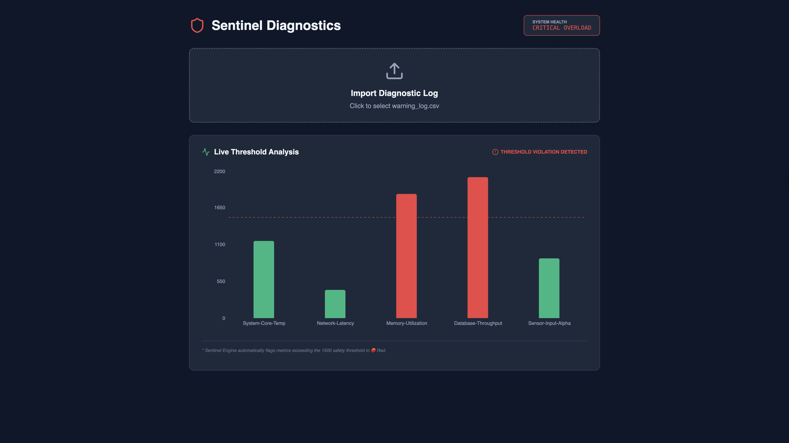

# 🛡️ Sentinel Diagnostics

A full-stack hardware monitoring dashboard that analyzes diagnostic logs and provides real-time visual alerts for system critical thresholds.

---

## 📊 Preview
<div align="center">
  
</div>

---

## 🚀 Features
* **Automated Log Parsing:** FastAPI backend cleans and processes CSV diagnostic data.
* **Dynamic Thresholding:** Metrics exceeding **1500** are automatically flagged in 🔴 **Red**.
* **Health Status Engine:** Top-level system status shifts to "CRITICAL OVERLOAD" when hardware is at risk.
* **Modern UI:** Dark-mode interface built with React and Recharts for high visibility.

## 🛠️ Tech Stack
* **Frontend:** React.js, Lucide-React, Recharts
* **Backend:** Python, FastAPI, Pandas

## 🚦 Getting Started

### 1. Backend
```bash
cd backend
source venv/bin/activate
python main.py
```
### 2. Frontend
```bash
cd frontend
npm run dev
```